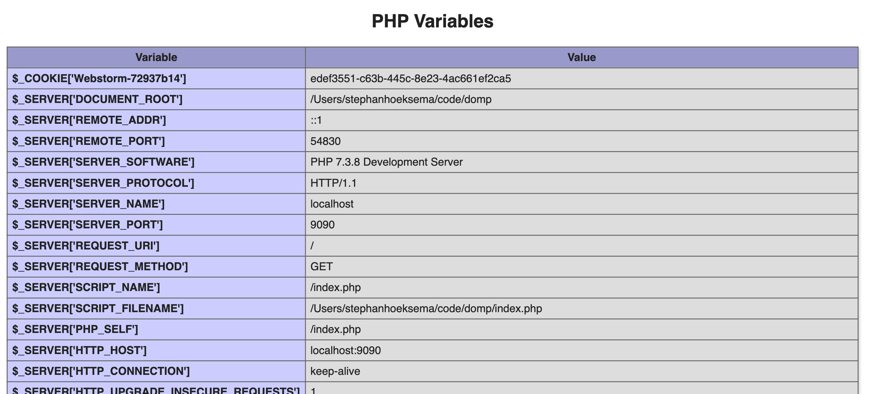

#Core

`phpinfo()` hier krijgen we een overzicht van alle onderdelen die met een `responce`
 bij een html pagina worden meegestuurd.

De onderdelen waar we nu naar kijken zijn:
* `REQUEST_URI`
Staat voor Uniform Resource Identifier deze identificiert waar de vraag vandaan komt.

* `REQUEST_METHOD`