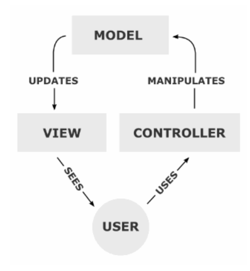

# Model

Dit is de plaats in je applicatie waar alle data permanent opgeslagen of geraadpleegd wordt. De model zorgt voor de toegang om de data te zien, te verzamelen of te schrijven naar de database. Het is de brug tussen de controllers en de views.

Vaak wordt er gezegd dat de model 'blind' is. De model weet niet wat er met de data gebeurd nadat het opgehaald is en doorgestuurd word naar de view of naar de controller. De model zoekt ook geen interactie tussen de componenten. Er wordt om data gevraagd, geschreven of verwijderd dit doet de model meer niet.
