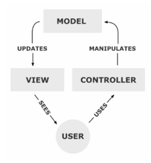

# Views

Bij het ontwerpen van een MVC model werd er in eerste instantie rekening gehouden dat er heel veel gedaan werd in de view. Tegenwoordig wordt de view vaak gebruikt voor het afhandelen van de data en de design. Het MVC is in eerste instantie zo opgezet dat er in de view ook alle logica zat. Tegenwoordig wordt de logica vaak in de controllers behandeld.

Hier zullen wij voornamelijk de templates voor de designs neerzetten. 